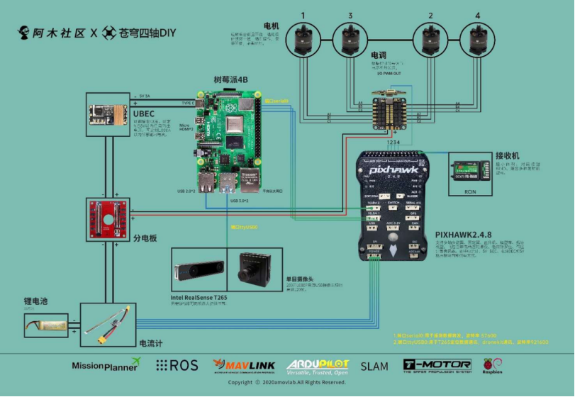

Z410 无人机使用教程目录
==========================

   
1. 资料下载链接
==============

1.1 Missionplanner 地 面 站 软 件 下 载 链 接 ：
------------------------------------------------
  
https://pan.baidu.com/s/1h2o82bcXtuHvk-8DN4I7tg  
提取码：deq6

.. attention:: 注意：电脑最好是使用 Win10 系统，Win10 以前的系统可能由于缺少必要的插件会导致启动失败。

1.2 Ardupilot（3.6.11） 固 件 下 载 链 接 ：
--------------------------------------------
     
https://pan.baidu.com/s/1dhFrmA8FpGdzqO8\_WAwpzQ 提取码：e1a0

.. attention::注意：无人机发货前已经组装调试好，不需要再下载固件，此固件可留着备用。

1.3 PC 端安装Ubuntu 系统：
----------------------------------------------------

.. hint::  PC 端安装 Ubuntu 系统的目的是搭建Ardupilot 开发环境，从而使用SITL 仿真。

Ubuntu16.04 纯 净 版 系 统 的 镜 像 下 载 链 接 ：
      
https://man.linuxde.net/download/Ubuntu_16_04 

以下教程是搭建 Ardupilot
开发环境，提供给大家作为参考：

https://mp.weixin.qq.com/s/bQKTX83QI3d-xDys4xPLOQ

.. attention::  注意：国内由于网络原因，开源的 Ubuntu系统的使用会遇到各种各样的不同问题，使用时建议先更换 ubuntu 源和 PIP源。遇到问题更多的需要到官网，论坛或则利用搜索引擎来解决问题。

.. tip:: 以下是安装好 Ardupilot 开发环境镜像，是通过Systemback 从我们的PC端上制作的。不一定适合所有电脑配置的安装。所以我们不能保证您的电脑一定能安装上。免费赠送给大家使用

      
Ubuntu
      
镜像下载链接：链接：\ https://pan.baidu.com/s/1zSJz10zqVYUZRXxnDSQSNw
      
提取码：zidd

请参考以下教程在win
系统电脑上安装双系统（如果双系统安装不了，可以尝试安装虚拟机） 

教程 1：
https://pan.baidu.com/s/1IjKYLR6pYuVm606e2LNNTg      
提取码：3yoe

      
教程 2： https://pan.baidu.com/s/19VlTC8NxV5-s_tgn3xx4Ng      
提取码：5jry

2. Z410 机型介绍
==============

Z410无人机是一款专为无人机二次开发入门设计的一款实验机型。

- 基础版采用pixhawk2.4.8飞控和M8NGPS 模块；
- 单目版在基础板机型上安装了树莓派 4B 机载电脑，树莓派可通过Dronekit-python、ROS、Opencv 编程实现对无人机的外部控制；
- 视觉版在单目版基础上安装了 intel T265 双目相机，可实现在无 GPS环境下的定位导航。

.. tip:: 树莓派系统基于 ubuntu20.04打造，集成了多种功能模块：ROS、mavros、Dronekit-python、Opencv、Rpanion-server等。大家不用再花费时间安装编译这些功能包，参考例程可直接上手学习。

2.1 Z410 硬件接线图
-------------------

  

2.2 主要硬件设备及用途介绍
--------------------------

-  飞控：pixhawk2.4.8-- 无人机正常飞行的必要硬件，控制无人机姿态；

-  树莓派：raspberry pi 4B--运行外部控制程序及其他系统集成，给飞控发送外部控制命令，或则网络- -信号；（单目版和视觉版配置）
-  电调：定制--接收飞控的输出信号，处理后驱动电机旋转；
-  电机：T-motor2216--电机旋转带动桨叶，从而给无人机提供上升的动力；
-  电池：3S 5200mah--无人 机的动力来源；
-  电流计：给飞控提供稳压电源；检测实时电压，当电池电压过低采取预设值的动作，自主降落或返航；
-  UBEC：给树莓派提供稳定的电源；（单目版和视觉版配置）
-  T265 双目相机：用于视觉定位；（单目版和视觉版配置）
-  单目摄像头：用于实时视频回传；（单目版和视觉版配置）
-  接收机：与遥控器配套，接收遥控器的控制信号，从而控制无人机飞行；

3. 如何快速进行第一次解锁
========================

3.1 将无人机平放在地面上；

3.2 电池插上 BB 响报警器，贴上魔术贴，绑扎在飞机底板上；

3.3 打开遥控器，将油门摇杆拉倒最低，SWA~SWD 开关均拨到 1挡，解除遥控器报警；

3.4 将无人机接上电池，等待飞控自检。自检时间大概 30秒左右。此时飞控会闪黄灯，电机会发出“滴滴”声；

3.5 长按安全开关，直到安全开关 LED 指示灯常亮。此时飞控 LED会蓝灯闪烁，电机“ 滴滴 ”声停止；

3.6 遥控器左边油门摇杆往右下角一直按住大概 2秒左右，蜂蜜器会长鸣一声，表示飞控已解锁。此时飞控蓝灯长亮，电机会怠速旋转；

3.7 推动油门超过 50%，电机会加速；

3.8 油门摇杆往左下角一直按住大概 2秒左右，飞控会上锁。此时飞控蓝色指示灯闪烁； 基本的解锁上锁操作完成。

.. raw:: html

   <iframe width="696" height="422" src="//https://www.bilibili.com/video/BV1EM4y1T7ws?p=11 frameborder="no" framespacing="0" allowfullscreen="true"> </iframe>

   

4. 如何进行第一次试飞(新手初次请勿在室内进行飞行)
================================================

.. hint:: 新手请先参考 Z410、基础版室外飞行基本操作视频。了解遥控器的基本使用后再进行飞行。盲目的飞行会导致飞行器损坏甚至人身伤害，请务必注意安全：

4.1 Z410 飞 行 前 的 准 备 ：
----------------------------------------------------

4.2 遥控器介绍及自稳模式飞行：
----------------------------------------------------
.. raw:: html

   <iframe width="696" height="422" src="//https://www.bilibili.com/video/BV1EM4y1T7ws?p=12 frameborder="no" framespacing="0" allowfullscreen="true"> </iframe>

   

4.3 定高，悬停，返航模式飞行：
----------------------------------------------------
.. raw:: html

   <iframe width="696" height="422" src="//https://www.bilibili.com/video/BV1EM4y1T7ws?p=13 frameborder="no" framespacing="0" allowfullscreen="true"> </iframe>

   

4.4 降落，绕圈，有头，无头及结束飞行操作：
----------------------------------------------------
.. raw:: html

   <iframe width="696" height="422" src="//https://www.bilibili.com/video/BV1EM4y1T7ws?p=14 frameborder="no" framespacing="0" allowfullscreen="true"> </iframe>

   
5. 使用这台无人机需要具备的一些基础知识：
=======================================

5.1 锂电池的正确使用方法和充电操作：
-----------------------------------

.. raw:: html

   <iframe width="696" height="422" src="//https://www.bilibili.com/video/BV1EM4y1T7ws?p=17 frameborder="no" framespacing="0" allowfullscreen="true"> </iframe>

.. tip:: 注意：锂电池是易燃易爆品，短路、剧烈碰撞、针刺，高温等情况都有可能导致锂电池燃烧，使用时请务必注意安全。请置于阴凉干燥处存放。

5.2 BB 响低电压报警器的使用
---------------------------

.. raw:: html

   <iframe width="696" height="422" src="//https://www.bilibili.com/video/BV1EM4y1T7ws?p=15 frameborder="no" framespacing="0" allowfullscreen="true"> </iframe>

5.3 数传模块的使用(基础版机型配数传)
------------------------------------

.. raw:: html

   <iframe width="696" height="422" src="//https://www.bilibili.com/video/BV1EM4y1T7ws?p=16 frameborder="no" framespacing="0" allowfullscreen="true"> </iframe>

5.4 Pixhawk 飞控的基本调试、地面站的使用参考教程：
--------------------------------------------------

-  第一节：\ https://mp.weixin.qq.com/s/OC10elPEhG5Ut0i44SAemw

-  第二节：\ https://mp.weixin.qq.com/s/ldYP71GftgAF9tEnrcgi4w

-  第三节：\ https://mp.weixin.qq.com/s/OvN6VtMtSChqy3H2gMlC3w

.. hint::  无人机发货前已经进行了调试和试飞。所以没有必要按照教程再做一遍。教程提供给大家学习。

5.5 飞 行 模 式 的 含 义 和 正 确 使 用
---------------------------------------

https://mp.weixin.qq.com/s/IeAHBmnx_ea3Qd8Jd1NVOA

5.6 Ubuntu 系 统 是 基 本 操 作
-------------------------------

https://mp.weixin.qq.com/s/wOzOCACHgsz8meFa7QHRJg