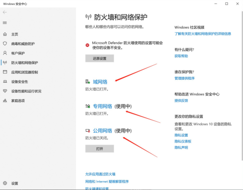
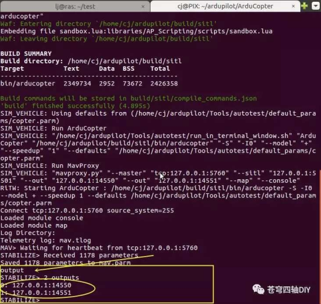
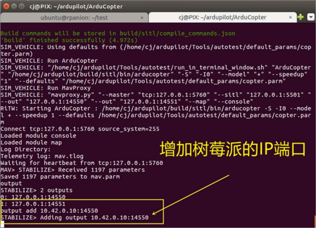
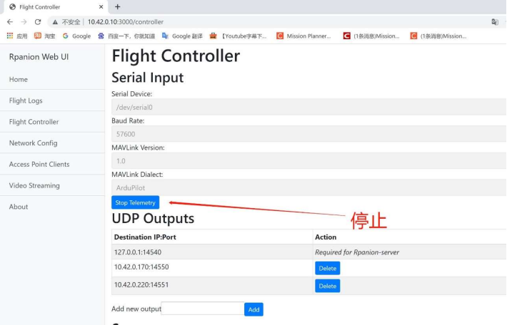

Z410-4B 单目版教程
==================

Z410 单目版在基础版配置上，扩展了树莓派 4B机载电脑。目前该系统集成了数据遥测转发，高清视频回传，ROS，mavros，Dronekit-python
等。我们需要先配置好网络，通过PC远程连接到树莓派，进而实现对无人机的操作。

.. hint:: 这个是提示树莓派能做什么，为什么要扩展树莓派？ 树莓派是一款基于ARM的微型电脑主板，英文名：RaspberryPi。是一款入门及的机载电脑。它能够通过串口连接使用 MAVLink协议与飞控进行通信这可用于执行额外的任务，

.. important:: 例如：通过 python、ROS编程实现对无人机的飞行控制；通过安装单目相机实现图像识别，由于存储图像的内存要求，单靠飞控根本无法完成这些任务。

如何对无人机的树莓派进行操作？

1. 建立网络连接：
=================

将电池插上 BB响报警器，绑扎在底板上。无人机连接电池插口，即可启动。

.. hint:: 启动后先不要挪动无人机，等待飞控和树莓派启动系统，大概2 分钟左右。

系统启动后自动启动 WIFI 热点。 WIFI 名称：ACopter密码：12345678 将笔记本 WIFI 连接到树莓派热点。 

.. attention:: 注意：因 WIFI信号范围最大 30 米左右

2. 使用树莓派遥测转发功能，将无人机与地面站进行连接
===================================================

树莓派集成了飞控数据遥测转发的功能，相当于一个路由器。这样我们可以通过
WIFI 网络远程连接飞控和PC 端地面站软件。

具体操作参考视频 ：

.. raw:: html

   <iframe width="696" height="422" src="//https://www.bilibili.com/video/BV1EM4y1T7ws?p=1 frameborder="no" framespacing="0" allowfullscreen="true"> </iframe>

.. attention:: 注意：如果不能通过 UDP 连接，请先关闭 windows 防火墙。

3. 使用树莓派的图传功能，可实时回传视频到地面站
===============================================

树莓派集成了高清图传回传功能，可以将 USB摄像头拍摄的实时高清信号图像回传到 
PC端地面站软件、或则图像播放软件，如：VLC media player。

（下载链接：https://www.videolan.org/）

MP地面站软件显示高清视频需要先安装 GStreamer，下载链接及教程：

https://pan.baidu.com/s/1AyvQNj2m4E4fMHS6JYnpJA 提取码:f7c3

安装好 GStreamer 以后，视频回传操作参考以下视频：

.. raw:: html

   <iframe width="696" height="422" src="//https://www.bilibili.com/video/BV1EM4y1T7ws?p=2 frameborder="no" framespacing="0" allowfullscreen="true"> </iframe>

4. PC 访问树莓派的 3 种方式：
===========================================

方法 1：windows 系统下通过远程桌面访问树莓派： 
-------------------------------------------

4.2.1 打开 windows 远程桌面； 

4.2.2 填入树莓派 IP：10.42.0.10，点 连接； 

4.2.3 在终端输入用户名：ubuntu，密码：123456abc； 

4.2.4 确认后即可连接到树莓派桌面(注意：远程桌面连接占用带宽比较大，速度略有卡顿是正常的。

.. raw:: html

   <iframe width="696" height="422" src="//https://www.bilibili.com/video/BV1EM4y1T7ws?p=3 frameborder="no" framespacing="0" allowfullscreen="true"> </iframe>

.. tip:: 方法 1 优点：有桌面系统，直观可看。对初学者来说比较容易接受； 

.. attention::  方法 1 缺点：远程桌面会占用很多资源，导致卡顿； 

方法 2：windows 系统下通过PUTTY 访问树莓派： 
-------------------------------------------
4.2 在 PC 端 安 装 PuTTY， 下 载 链 接:

https://the.earth.li/~sgtatham/putty/latest/w64/putty-64bit-0.75-installer.msi

4.2.6 启动 PuTTY，填写树莓派 IP：10.42.0.10，密码：123456abc 

.. raw:: html

   <iframe width="696" height="422" src="//https://www.bilibili.com/video/BV1EM4y1T7ws?p=4 frameborder="no" framespacing="0" allowfullscreen="true"> </iframe>

.. tip:: 方法2 优点：访问执行速度快，需要同时使用 MP 地面站和终端命令行比较方便；

.. attention::  方法2 缺点：命令行显示，对初学者来说不直观；需要远程调用 ubuntu 系统下的窗口不能用这个方法。

方法 3：ubuntu 系统下远程访问树莓派： 
-------------------------------------------

4.2.8 笔记本打开一个终端，使用下面的命令修改笔记本上的 hosts 文件：
将树莓派 4b 的 IP 地址（10.42.0.10）加入到hosts 文件中，并保存退出; 

.. raw:: html

   <iframe width="696" height="422" src="//https://www.bilibili.com/video/BV1EM4y1T7ws?p=5 frameborder="no" framespacing="0" allowfullscreen="true"> </iframe>

   
关于 vim 编辑器的使用，可以参考以下教程的部分内容：

https://mp.weixin.qq.com/s/GekdU6_kTDcfvTBq9jVJFQ

.. tip:: 方法 3 优点：执行速度快，ubuntu 系统下可以做更多的开发

.. attention::  方法 3 缺点：不能同时使用 MP 地面站

树莓派的关机操作
===================

树莓派是机载电脑，突然断电有可能造成系统损坏无法开机。建议大家使用以下 2
种方式进行正常的关机操作。 

- 方法 1: 在命令行终端，输入关机命令
- 方法 2：通过web 管理界面关机

.. raw:: html

   <iframe width="696" height="422" src="//https://www.bilibili.com/video/BV1EM4y1T7ws?p=10 frameborder="no" framespacing="0" allowfullscreen="true"> </iframe>

树莓派关机以后，等待大概 1分钟左右，树莓派电源指示灯熄灭，再断开无人机电池。

5. 使用 Dronekit 测试连接飞控并读取状态数据
==========================================================
Dronekit 介绍：
Dronekit 也叫 DroneKit-Python，是一个用于控制无人机的 Python库。
有了它你就可以在机载电脑上通过 Python编程实现对无人机的控制。

.. tip:: Dronekit 可以显着增强自动驾驶性能，为飞行器增加更多智能，以及执行计算密集或时间敏感的任务（例如，计算机视觉，路径规划或3D建模）。

除了 DroneKit-Python 以外，还有 DroneKit-Android 以及
DroneKit-Cloud 的 API 供不同的开发者使用。API 通过 MAVLink与飞控通信。它提供对连接飞控的遥测，
状态和参数信息的编程访问，并实现任务管理和对飞行器运动和操作的直接控制。

.. attention:: 相比之下，Dronekit 比搭建 ros 来控制无人机更容易上手一些。 对于Dronekit，PX4(原生固件)被支持的较少，目前不可以进行模式切换。而对Ardupilot(APM固件)支持的比较多，可调用的函数也比较多。

单目版机型我们已经在树莓派上安装好 Dronekit，并且在根目录下有一个 test文件夹，
存放了几个演示示例，大家可以根据下面的教程操作。

.. tip::如果想了解树莓派与 pixhawk 飞控具体如何连接，以及如何安装 dronekit的过程，可参考以下链接有详细介绍：

第一节：\ https://mp.weixin.qq.com/s/t0ur7p8Q-xN2qAHnjo2p4A

第二节：\ https://mp.weixin.qq.com/s/GekdU6_kTDcfvTBq9jVJFQ

5.1 运行连接示例
-----------------------

使用 Dronekit 代码读取飞控当前状态，测试树莓派与飞控之间通讯是否正常：

5.1.1 无人机连接电池，笔记本开启一个终端窗口； 

5.1.2 通过 ssh命令，连接无人机上的树莓派； 

5.1.3 将路径切换到 test 文件夹：

5.1.4 运行 connect.py 脚本：

成功运行后,会显示如下信息:

.. figure:: https://img-blog.csdnimg.cn/df2567870c8e47338591122613ef0041.png#pic_center
   :alt: 在这里插入图片描述

说明树莓派通过 Dronekit

.. hint::读取到了目前飞控的数据：系统警报、固件版本、姿态数据、电池电量、解锁状态、当前飞行模式等等。
这样就成功运行了第一个DroneKit-Python 脚本。

.. attention:: 注意：如若出现连接异常超时警报，请检查物理连接(usb 转 TTL 模块)是否连接好；或则打开 connect.py 程序查看连接端口是否为ttyUSB0；无人机通电后如果长时间没有使用串口，串口有可能关闭，无人机重新启动，再执行以上程序。

5.1.5 如果想查看 connect.py 脚本，可通过 vim 编辑器查看，执行如下命令：

.. code:: c
      sudo vim connect.py

其中脚本注释如下：

.. code:: c

    # 飞控软件版本
    print "Autopilot Firmware version: %s" % vehicle.version
    # 全球定位信息（经纬度，高度相对于平均海平面）
    print "Global Location: %s" % vehicle.location.global_frame
    # 全球定位信息（经纬度，高度相对于 home 点）
    print "Global Location (relative altitude): %s" %vehicle.location.global_relative_frame
    # 相对 home 点的位置信息（向北、向东、向下）；解锁之前返回 None
    print "Local Location: %s" % vehicle.location.local_frame
    # 无人机朝向（欧拉角：roll，pitch，yaw，单位为 rad，范围-π 到+π）
    print "Attitude: %s" % vehicle.attitude
    # 三维速度（m/s）
    print "Velocity: %s" % vehicle.velocity
    # GPS 信息
    print "GPS: %s" % vehicle.gps_0
    # 地速（m/s）
    print "Groundspeed: %s" % vehicle.groundspeed
    # 空速（m/s）
    print "Airspeed: %s" % vehicle.airspeed
    # 云台信息（得到的为当前目标的 roll, pitch, yaw，而非测量值。单位为度）
    print "Gimbal status: %s" % vehicle.gimbal
    # 电池信息
    print "Battery: %s" % vehicle.battery
    # EKF（拓展卡曼滤波器）状态
    print "EKF OK?: %s" % vehicle.ekf_ok
    # 超声波或激光雷达传感器状态
    print "Rangefinder: %s" % vehicle.rangefinder
    # 无人机朝向（度）
    print "Heading: %s" % vehicle.heading
    # 是否可以解锁
    print "Is Armable?: %s" % vehicle.is_armable
    # 系统状态
    print "System status: %s" % vehicle.system_status.state
    # 当前飞行模式
    print "Mode: %s" % vehicle.mode.name
    # 解锁状态
    print "Armed: %s" % vehicle.armed

6. 启动 SITL 仿真环境并运行 python 示例
--------------------------------------

在 test文件夹下我们有几个演示脚本，如果单纯的运行脚本新手没有直观的感受。我们可以结合无人机仿真环境，来学习脚本具体的执行过程。
前面笔记本上安装好 ubuntu 系统镜像，里面已经搭建好了 ardupilot开发环境。SITL 仿真也就包含其中。 需要注意：DroneKit-SITL

.. attention::目前仅为Mac，Linux 和Windows 提供x86 二进制文件。不能在树莓派这样的ARM平台上运行它。 我们执行的python 脚本是在树莓派系统上，而 SITL仿真环境是搭建在笔记本系统上的。

6.1 树莓派端，进入 test 目录
--------------------------------------
      
.. code:: c
      cd test

6.2 编辑 example2.py
--------------------

.. code:: c
      sudo vim example2.py

将其中连接端口改为

.. code:: c

     connection_string = '10.42.0.10:14550' 

.. attention::为树莓派 IP 端口。脚本里面都配有详细注解，大家可根据注解来理解 dronekit的基本使用。

6.3 笔记本端，首先要进入需要仿真的多旋翼无人机的目录下：
--------------------------------------------------------

.. code:: c
      cd ardupilot/ArduCopter

第一次运行，需要执行下面的命令对仿真环境进行初始化

.. code:: c
   sim_vehicle.py -w

或则是仿真参数被改的乱七八糟的时候，也可用这个命令恢复初始参数。
启动完毕，使用 Ctrl+C 终止正在运行的

.. code:: c
   sim_vehicle.py --console --map

6.4 接下来就可以启动模拟器了：
------------------------------
.. code:: c
   output add 10.42.0.10:14550

正常启动后，就会看到三个窗口：Terminal, Console,Map，这样最基本的软件在环仿真 程序就运行起来了。

6.5 启动后通过 output 命令列出 MAVProxy 转发数据的接口，如下所示：
------------------------------------------------------------------

6.6 使用 output add 命令增加树莓派 IP 接口：
--------------------------------------------
output add 10.42.0.10:14550

与 example2.py 代码中端口地址一致。

6.7 树莓派端执行：
------------------

.. code:: c
      python2 example2.py

运行 example2.py 代码

6.8 我们还可以将航点文件导入 SITL 进行演示
------------------------------------------

.. raw:: html

   <iframe width="696" height="422" src="//https://www.bilibili.com/video/BV1EM4y1T7ws?p=20 frameborder="no" framespacing="0" allowfullscreen="true"> </iframe>

7. SITL 仿真结合MP 地面站运行 python 示例
========================================

首先，将树莓派无人机接上电池，确保 ubuntu 电脑，MP
地面站电脑都连接到树莓派WIFI 热点。

.. attention:: MP 地面站电脑： 要在 MP上显示仿真，遥测连接务必断开。因为遥测连接的是实际的飞控，做仿真需要连接仿真数据。

ubuntu 笔记本端： 启动 SITL 仿真

.. code:: c
      cd ~/ardupilot/ArduCopter
      sim_vehicle.py --console --map

使用 output add 命令，增加树莓派的 IP：

.. code:: c
      output add 1

再使用 output add 命令，增加 MP 地面站的 IPMP 地面站 IP地址在遥测页面查看：

.. code:: c
      output add 10.42.0.170:14551

树莓派端： 运行示例代码：

.. code:: c
   cd test
   python2 example2.py

以下视频演示 SITL 仿真如何结合 MP 地面站运行

.. raw:: html

   <iframe width="696" height="422" src="//https://www.bilibili.com/video/BV1EM4y1T7ws?p=8 frameborder="no" framespacing="0" allowfullscreen="true"> </iframe>

SITL 与 MP 地面站结合运行，那么我们可以直接在 MP地面站的全部参数列表里，查找需要修改的参数进行修改。

有 关 SITL 仿 真 的 详 细 介 绍 ， 可 查 看 以 下 链 接 ：

https://ardupilot.org/dev/docs/using-sitl-for-ardupilot-testing.html

8. 使用 Python 脚本控制无人机飞行
=================================

根据 dronekit 的官方示例，我们编写了几个简单的程序控制无人机飞行。

.. attention::编写完以后先在 SITL仿真环境下运行看看是否和预想的一致。没有问题后，再连接无人机实地飞行。

example5.py 控制无人机起飞到 3 米高度，然后悬停 5 秒，再自动降落；
大家可根据我们提供的示例，结合自己的实际情况，编写控制程序。

Dronekit 室外控制无人机起飞降落演示 ：

.. raw:: html

   <iframe width="696" height="422" src="//https://www.bilibili.com/video/BV1EM4y1T7ws?p=19 frameborder="no" framespacing="0" allowfullscreen="true"> </iframe>

example4.py 在室外空旷处，此脚本控制无人机起飞到 3 米高度，然后飞出一个
2 米\*2 米的正方形，再自动降落。

Dronekit 室 外 控 制 无 人 机 飞 出 一 个 正 方 形 演 示 ：

.. raw:: html

   <iframe width="696" height="422" src="//https://www.bilibili.com/video/BV1EM4y1T7ws?p=18 frameborder="no" framespacing="0" allowfullscreen="true"> </iframe>

.. attention::还有值得注意的是，python 脚本中设置属性：少数的属性变量可以被设置，通过设置这些属性变量，可以控制无人机的运行状态。可设置的属性变量如下：

.. code:: c
      vehicle.home_location 
      vehicle.gimbal
      vehicle.airspeed 
      vehicle.groundspeed
      vehicle.mode
      vehicle.armed
      vehicle.disarmed

设置示例： 

1. 锁定无人机：
   
.. code:: c
      vehicle.disarmed = False

2. 切换到 GUIDED 模式：

.. code:: c
      vehicle.mode = VehicleMode("GUIDED")

3. 设置航点模式下，无人机飞行的地速为 3.2m/s（注意：读、写 groundspeed
   的意义不 同）
  
.. code:: c
   print "Param: %s" % vehicle.parameters['THR_MIN']
   vehicle.groundspeed = 3.2
   

读取参数 参数以字典（dictionary）的形式，存储在 vehicle.parameters
变量中。具体参数的名称即为相应的键值（key）。 

.. code:: c
   print "Param: %s" % vehicle.parameters['THR_MIN']

例如，在屏幕上显示
THR\_MIN 参数（THR\_MIN 代表油门处于最低时的电机怠速，以PWM 值表示）：

显示全部参数：

.. code:: c
   print "\nPrint all parameters (iterate `vehicle.parameters`):"
      for key, value in vehicle.parameters.iteritems():
   print " Key:%s Value:%s" % (key,value)

设置参数 使用读取参数类似的方法，即可设置参数：

.. code:: c
   ehicle.parameters['THR_MIN']=0

.. hint::以上只是截取了部分使用较多的知识点进行介绍，完整的教程可以到官网查看。

关于dronekit 的一些参考资料： 有关项目文档，请访问（这包括指南，示例和API 参考资料）

https://readthedocs.org/projects/dronekit-python/。 

示例源代码托管在 Github 上，作为/ dronekit-python /examples 的子文件夹。

DroneKit论坛是寻求有关如何使用该库的技术支持的最佳场所。 也可以查看 Gitter channel

- 说明文件：https://dronekit-python.readthedocs.io/en/latest/about/index.html
- 指南：https://dronekit-python.readthedocs.io/en/latest/guide/index.html

API
++++++++

- 参考：https://dronekit-python.readthedocs.io/en/latest/automodule.html
- 例子：/dronekit-python/examples
- 论坛：https://github.com/dronekit/dronekit-python/issues Gitter:
- https://gitter.im/dronekit/dronekit-python