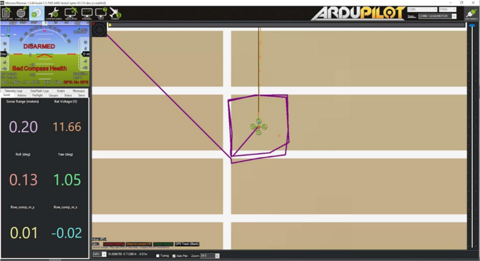

Z410 视觉版教程
===============

为什么要使用双目相机？ 

我们在室外飞行的时候，无人机定位是依靠  GPS全球定位系统。
无人机需要接收来自GPS卫星的电子三角测量信号，同时山脉和建筑物的反射会造成多径干扰。
所以在高大建筑周边，建筑物室内和隧道等地方就没有 GPS 信号，我们就需要使用其他方法进行定位导航。

.. hint:: GPS 导航现已十分普及，但 GPS 的精度目前限制在大约 10 米。另外，更新速率比较慢，大约是10Hz，并且只能支持户外，

视觉版机型在单目版基础上增加了intel T265 双目相机，可以通过v-
slam(视觉惯性测距即时定位与地图构建)技术，让无人机进行室内定位导航。

.. hint:: 英特尔实感追踪摄像头T265 是一个完整的嵌入式 SLAM解决方案。

英特尔实感追踪摄像头T265
它根据VIO（视觉惯性里程计）并利用最新的算法来输出 6自由度追踪。
通过对 6自由度姿态数据（位置和方向）的处理，发送给无人机定位。
双目定位后，如果室内空间足够，就可以进行悬停飞行，一键返航，航点飞行等。
从而为以后室内测试更复杂的避障，导航规划等项目奠定基础。

1. 一些常用的 T265 命令
=======================

在安装有 ubuntu 系统的 PC 端，输入以下命令来实时查看 T265 视频： 演示
视频 ：

.. raw:: html

      <iframe width="696" height="422" src="//https://www.bilibili.com/video/BV1EM4y1T7ws?p=9 frameborder="no" framespacing="0" allowfullscreen="true"> </iframe>
   
   

.. tip::realsense-viewer: RealSense Viewer 是旗舰工具，通过简单的跨平台UI提供对大多数相机功能的访问。 注意：由于树莓派WIFI 带宽有限，通过ssh访问树莓派开启 realsense-viewer 是有卡顿的。如果要观察T265视频画面，建议使用 rs-capture 命令。

https://github.com/IntelRealSense/librealsense/tree/master/tools/realsense-viewer

rs-capture：将深度和 RGB
数据流式传输和渲染到屏幕

https://dev.intelrealsense.com/docs/rs-capture

rs-pose:
应用程序将打开一个窗口，在该窗口中打印设备位置相对于初始位置的当前x、y、z 值。

https://dev.intelrealsense.com/docs/rs-pose

rs-pose-predict:应用程序应打开一个窗口，在该窗口中打印设备位置相对于其初始位置的预测x、y、z 值。

https://dev.intelrealsense.com/docs/rs-pose-predict

rs-enumerate-devices：

.. hint::   T265在出厂前就对相机进行了标定，每个相机内部都带有相机的内参和外参。
在终端中输入此命令，即可读取到T265 的配置信息 rs-enumerate-devices-c：如果需要读取到相机内参和外参，以及IMU 的参数则可以使用此命令（添加-c
参数）

2. 启用 T265 定位的飞控参数设置
===============================

.. attention::  注意：默认情况下，无人机发货前设置 pixhawk 飞控使用 GPS在室外定位导航。如果要使用 T265双目相机进行室内定位，飞控参数需要进行如下设置： 把飞控连接地面站，点击配置/调试 菜单---全部参数列表:

.. code:: c
      AHRS_EKF_TYPE = 2 (默认使用 EKF2） EK2_ENABLE = 1 (默认)
      EK3_ENABLE = 0 ( 默 认 ) GPS_TYPE = 0 (不启用 GPS)
      EK2_GPS_TYPE = 3(不启用 EKF 使用 GPS) EK2_POSNE_M_NSE = 0.1
      EK2_VELD_M_NSE = 0.1
      EK2_VELNE_M_NSE = 0.1
      COMPASS_USE = 0, COMPASS_USE2 = 0, COMPASS_USE3 = 0 ( 禁 止 EKF
      使用指南针，而是依靠外部导航数据的航向)
      RTL_ALT=0 室内测试请将返航高度设置为0，让飞行器以当前高度返航。默认是1500mm。

.. tip:: 以下是飞控默认数据，要使用 GPS 定位改回来就可以了

.. code:: c
      AHRS_EKF_TYPE = 2 (the default) 
      EK2_ENABLE = 1 (the default)
      EK3_ENABLE = 0 (the default) 
      GPS_TYPE = 1
      EK2_GPS_TYPE = 0
      EK2_POSNE_M_NSE = 1
      EK2_VELD_M_NSE = 0.7
      EK2_VELNE_M_NSE = 0.5
      COMPASS_USE = 1, COMPASS_USE2 = 0, COMPASS_USE3 = 0

.. tip::  本机搭载 Intel T265 双目相机，在室内没有 GPS 信号的情况下，代替 GPS导航定位。双目定位后，如果室内空间足够，就可以进行悬停飞行，一键返航，失控返航，航点飞行。从而为以后室内测试更复杂的避障，导航规划等项目奠定基础。

3. 使用 T265 定位导航的 2 种方法
===============================

3.1使用 pyrealsense2 启动双目相机
-----------------------------------------------------------

使用 pyrealsense2 定位原理：将从 Realsense T265 获得的 6
自由度姿态数据（位置和方向）和置信度数据交由 python
脚本处理(该脚本位于vision\_to\_mavros/scripts/t265\_to\_mavlink.py)，处理后的结果通过
MAVLink 发送到ArduPilot 无人机，从而实现定位。 该脚本将执行以下任务：

- 使用 pyrealsense2 的相关 API 获取 6 自由度姿势数据并跟踪置信度数据，
pyrealesense2 是librealsense 的Python 包装器；

- 执行必要的矩阵变换，以匹配 Realsense T265 和 NED
的框架以及其他处理步骤； 

- 将姿态数据打包到 MAVLink 消息VISION\_POSITION\_ESTIMATE中，
并将置信度数据打包到虚拟消息中，然后将它们以预定频率发送到ArduPilot，以免输入数据淹没飞控；

- 自动设置 EKF home 点，让设置和飞行都更为简单；

飞行器机载电脑已经安装好 librealsense 和
pyrealsense2，根据以下步骤即可启动 T265

3.1.1无人机接上电池，打开 missionplanner 地面站，使用数传连接地面站和飞控；
----------------------------------------------------------------------------------------------------------------------

3.1.2 使用 ssh 远程连接树莓派，操作和之前一样；
-----------------------------------------------------------

3.1.3 打开终端，切换路径到脚本所在目录：
-----------------------------------------------------------

.. code:: c
      cd ~/vision_to_mavros/catkin_ws/src/vision_to_mavros/scripts

3.1.4 执行下面脚本：
-----------------------------------------------------------

.. code:: c
      python3 t265_to_mavlink.py

3.1.5 地面站软件，快捷键 CTR+F，点击 Mavlink Inspector，能看到数据已经上传到飞控了。
----------------------------------------------------------------------------------------------------------------------

.. figure:: https://img-blog.csdnimg.cn/fc6b7ea335c5412e8e738bd0ebb95594.png#pic_center
   :alt: 在这里插入图片描述

同时 usb 转 ttl 模块上的 rx 和 tx 指示灯会快速闪烁，表示有数据传输；
脚本正常个运行后，并且 FCU 开始接收 VISION\_POSITION\_ESTIMATE
消息，就看到地面站会消息框会显示“ GPS Glitch”和“ GPS Glitch
cleared”，确认系统已识别了外部本地化数据。

3.1.6 使用 Mission Planner: 
-----------------------------------------------------------
右键单击地图上的任意点> Set Home Here > Set EKF Origin Here.

稍等片刻直到四轴飞行器图标出现在 Mission Planner 的地图上；

3.1.7 检查地图上无人机的位置运动
-----------------------------------------------------------
拿起无人机并四处走动，检查地图上是否显示了无人机的位置运动。 地图上显示的无人机的轨迹应该反映真实的运动，而不会产生过多的失真或超调。 以下是在 2m x 2m 的正方形中行走的示例。

3.1.8 外部定位导航数据丢失
---------------------------------------------------------------------------------------------------------------------------------------------------------------------------------------------
如果外部定位导航数据由于任何原因丢失（跟踪丢失，脚本中断等），重新运行脚本也不会成功定位，需要重新启动无人机(重新上电)并执行之前的操作。
3.1.9 飞行测试：(请有无人机操作经验的人操作)

- 在自稳或则定高模式下解锁起飞，检查无人机飞行是否平稳；

- 使用遥控器操作无人机四处移动，并观察 Mission Planner
上的位置是否稳定； 

- 以上没有问题，保持无人机在 0.8~1 米左右高度，油门
50%左右，切换到 Loiter 模式，但是如果出现任何问题，请随时准备切换回
Stabilize (自稳)/ Alt-Hold(定高)；

- 正常情况下，无人机应该稳定悬停在空中；

- 遥控器操作无人机四处缓慢缓慢移动，查看无人机稳定状态。测试时注意始终准备切换回“稳定/保持”状态；

- 如果一切正常，下次就可以在 Loiter 模式下解锁和起飞。
注意：请确保双目相机水平向前安装，测试环境光照充足，双目前方特征明显的视觉范围测试。

3.2.0 数据查看：
---------------------------------------------------------------

- 视觉测距信息将出现在 VISO 数据闪存日志消息中。

- EKF的视觉测距信息将显示在 XKFD 消息中。

3.2.1 参考视频：
---------------------------------------------------------------

.. raw:: html

      <iframe width="696" height="422" src="//https://www.bilibili.com/video/BV1EM4y1T7ws?p=7 frameborder="no" framespacing="0" allowfullscreen="true"> </iframe>
   
   

3.2 ROS 系统下启用 T265
===========================

.. tip::这是第二种使用双目相机定位的方法。 ROS 下 双目相机 T265 的定位原理：从realsense-ros 节点获得的位置数据由vision\_to\_mavros节点处理，并通过主题/ mavros / vision\_pose / pose 发送到 mavros 节点。mavros 将负责 ENU-NED 帧转换，并通过 MAVLink 将其发送到 ArduPilot无人机，从而实现室内定位。

.. tip:: 本机已经安装好 librealsense、realsense-ros、mavros、vision\_to\_mavros等必要的组件

   根据以下教程即可启动 T265 定位。

3.2.1 主从机设置完成
------------------------------------------------------------------------------------------------------------------------------

3.2.2 无人机接上电池，打开 missionplanner 地面站，使用数传连接地面站和飞控；
------------------------------------------------------------------------------------------------------------------------------

3.2.3 使用 ssh 远程连接树莓派；
---------------------------------------------------------------

3.2.4 开启一个终端，运行 realsense-ros 节点
---------------------------------------------------------------
.. code:: c
      roslaunch realsense2_camera rs_t265.launch

/camera/odom/sample/ 和/tf 主题将以 200Hz 频率发布。

3.2.5 开启另一个终端，运行 mavros 节点
---------------------------------------------------------------
.. code:: c

    roslaunch mavros apm.launch
  

.. code:: c
      rostopic echo /mavros/vision_pose/pose

未发布。

3.2.6 开启第三个终端，运行 vision\_to\_mavros 节点
---------------------------------------------------------------

.. code:: c   

      roslaunch vision_to_mavros t265_tf_to_mavros.launch

.. code:: c   

      rostopic echo /mavros/vision_pose/pose

现在应该显示来自 T265 的姿态数据。

.. code:: c   
      rostopic hz /mavros/vision_pose/pose 

应该显示该主题以 30Hz 的频率发布。

.. tip::以上 3 个节点运行成功，并且 FCU 开始接收 VISION\_POSITION\_ESTIMATE消息，就看到地面站会消息框会显示“ GPS Glitch”和“ GPS Glitchcleared”，确认系统已识别了外部本地化数据。

3.2.7 设置 EKF HOME 点
----------------------------------------------------
.. code:: c   

      rosrun vision_to_mavros set_origin.py

- 使用 Mission Planner: 右键单击地图上的任意点> Set Home Here > Set EKF
Origin Here. 

- 使用脚本设置 EKF HOME 点，开启第四个终端，运行：

3.2.8 室内定位运行
------------------------------------------------------------------------------------------------------------------------------------------------------------------------------------------------------------------------------------------------------------
打开地面站软件，快捷键 CTR+F，点击 Mavlink Inspector，能看到数据已经上传到飞控了。室内定位运行成功，切换到 loiter 悬停模式，指示灯是蓝色，表示可以解锁； 

如果切换到 loiter 变成黄灯，表示室内定位运行失败，请重新检查再启动。

.. figure:: https://img-blog.csdnimg.cn/f08cd4a1417a4e53aa1faace1785dc41.png#pic_center
   :alt: 在这里插入图片描述

.. tip:: 同时 usb 转 ttl 模块上的 rx 和 tx 指示灯会快速闪烁，表示有数据传输；

3.2.9 四轴飞行器图标出现在 Mission Planner
---------------------------------------------------------------
稍等片刻直到四轴飞行器图标出现在 Mission Planner 的地图上；

3.3.0 2m x 2m 的正方形中行走
------------------------------------------------------------------------------------------------------------------------------
拿起无人机并四处走动，检查地图上是否显示了无人机的位置运动。 地图上显示的无人机的轨迹应该反映真实的运动，而不会产生过多的失真或超调。 以下是在 2m x 2m 的正方形中行走的示例

.. figure:: https://img-blog.csdnimg.cn/48f6d8af59c34349a900ae4b18f4a5a5.png#pic_center
   :alt: 在这里插入图片描述

3.3.1 飞行测试：(请有无人机操作经验的人操作)
---------------------------------------------------------------
- 在自稳或则定高模式下解锁起飞，检查无人机飞行是否平稳；

- 使用遥控器操作无人机四处移动，并观察 Mission Planner 和 rviz
上的位置，以查看跟踪是否稳定； 

- 以上没有问题，保持无人机在 0.8~1
米左右高度，油门 50%左右，切换到Loiter，但是如果出现任何问题，请随时准备切换回 Stabilize / Alt-Hold。

- 正常情况下，无人机应稳定悬停并能够保持其位置。
使用遥控器缓慢移动无人机 2-3 米，验证比例（便于在 rviz 上查看）

- 如果一切正常，下次就可以在 Loiter 模式下解锁和起飞。 注意：在切换到
Loiter 模式之前，请始终确认位置反馈运行正常。
注意环境中的工作边界，即由于缺少功能，请勿快速移动或旋转运动，可能丢失跟踪定位。

- 如果外部定位导航数据由于任何原因丢失（跟踪丢失，脚本中断等），重新运行脚本也不会成功定位，需要重新启动无人机(重新上电)并执行之前的操作。

3.3.2 数据查看：
---------------------------------------------------------------
.. code:: c

      rosrun vision_to_mavros set_origin.py
   
.. tip::视觉测距信息将出现在 VISO 数据闪存日志消息中。

3.3.3 令一次启动所有节点：
---------------------------------------------------------------
成功运行以上节点，下次可以只需要开启一个终端，使用下面这个命令一次启动所有节点：
此命令一次执行 3 个 launch：

.. code:: c

    rs_t265.launch apm.launch t265_tf_to_mavros.launch

.. tip::这样可避免开启多个终端，简化操作，方便飞行。 再使用脚本设置 EKF HOME点：

4. 以后扩展开发方向
==================

4.1 可测试扩展思岚 A1,A2 激光雷达避障(简单避障，不建图)；
--------------------------------------------------------

4.2 可测试扩展 4G/5G 通讯，远距离图数传，从而实现 4G/5G 控制；
-------------------------------------------------------------

4.3 可测试使用 AprilTags 进行的室内非 GPS 飞行（基于ROS）；
----------------------------------------------------------

4.4 可测试使用 ROS，Realsense T265 相机和AprilTag 进行精确着陆；
---------------------------------------------------------------

4.5 可测试使用 Apriltags 进行室内导航；
--------------------------------------

4.6 可测试在 RVIZ 里面查看 T265 轨迹；
-------------------------------------

4.7 可测试将整套系统可移植到无人车或则无人船上
---------------------------------------------

4.8 .....
--------

以上教程是Z410 的一些基本操作。大家可以利用 ubuntu 系统与ROS
系统的开源特性，在此基础上进行扩展，比如避障，跟踪，导航等方面。大家也可以加入到
Z410
技术讨论微信群，分享自己在开发方面的心得、方法、示例和对遇到的问题进行讨论。

